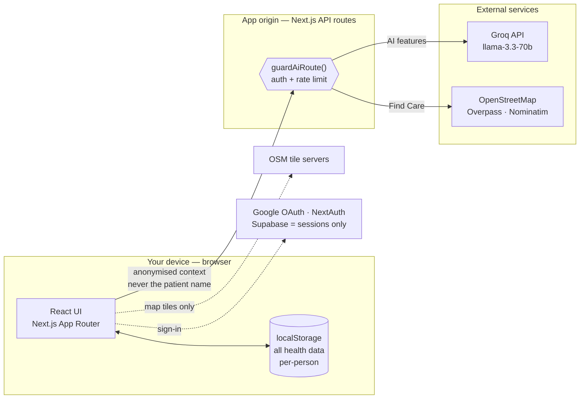
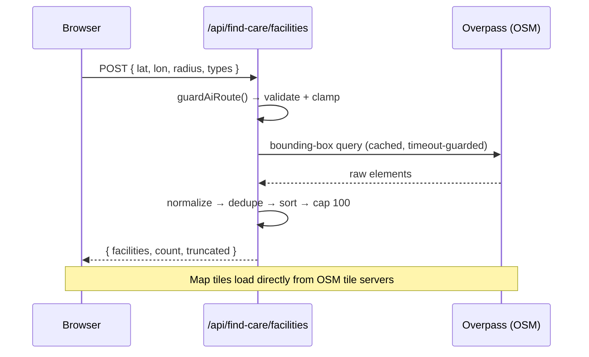

# Architecture

How CareCompanion is put together, and — most importantly — **where data lives
and what crosses the network**. If you read one thing before contributing, read
[Trust boundaries](#trust-boundaries).

---

## The one-sentence version

A Next.js app whose **health data never leaves the browser's `localStorage`**;
the only server-side code is a thin set of authenticated API routes that proxy
**anonymised** requests to external AI and map services.

---

## Data layer — localStorage, not a database

Every page reads and writes health data through **one module**,
[lib/api.ts](lib/api.ts), which delegates to
[lib/storage.ts](lib/storage.ts). There are **no database calls** on this path —
`lib/api.ts` opens with the invariant it enforces:

> `// All data is stored in localStorage per-person. No Supabase writes for medical data.`

- **Per-person namespacing.** Every read/write is scoped to the active profile
  via `storage.persons.getActiveId()`, so data never bleeds between family
  members. Switching profiles re-scopes every page instantly.
- **The domain types** (`Medication`, `Symptom`, `Appointment`, `VitalEntry`,
  `MedicalRecord`, `Note`, `JournalEntry`, `HealthProfile`, …) all live in
  [lib/storage.ts](lib/storage.ts) and are the single source of truth.
- **Backup/restore** ([lib/backup.ts](lib/backup.ts)) exports and imports the
  whole store as a JSON file that only ever touches the user's disk.

Consumers: [app/medications](app/medications), [app/symptoms](app/symptoms),
[app/vitals](app/vitals), [app/appointments](app/appointments),
[app/records](app/records), [app/notes](app/notes), [app/journal](app/journal),
[app/chat](app/chat), the dashboard ([app/page.tsx](app/page.tsx)), and
[components/GlobalSearch.tsx](components/GlobalSearch.tsx).

---

## Server surface — thin, authenticated proxies

The app has no backend for medical data. The API routes exist only to hold
secrets (API keys) and to talk to third parties the browser shouldn't hit
directly.

### AI routes (proxy to Groq)

`/api/chat`, `/api/health-chat`, `/api/summarize`, `/api/extract-report-data`,
`/api/check-interactions`, `/api/suggest-followup`, `/api/parse-pdf`.

Every one of them **must** call `guardAiRoute()`
([lib/api-guard.ts](lib/api-guard.ts)) as the first line of its handler:

1. **Auth** — verifies the NextAuth session; returns **401** otherwise.
2. **Rate limit** — 20 requests/minute per user (sliding window); **429** beyond.

They then call Groq via [lib/groq.ts](lib/groq.ts). Patient names are **never**
included — the health context is labelled `[anonymous]`. User-supplied fields
are length-capped before being interpolated into prompts.

### Find Care routes (proxy to OpenStreetMap)

`/api/find-care/facilities` (Overpass) and `/api/find-care/geocode` (Nominatim).
They reuse the same `guardAiRoute()` guard, then validate and clamp every input
(coordinates, radius 500 m–25 km, facility types) **before** any upstream call —
a bad request returns **400** and never reaches OSM. Pure query-building,
classification, and normalisation live in [lib/find-care.ts](lib/find-care.ts)
(client-safe, no server-only imports); caching, timeouts, and retries live in
[lib/find-care-cache.ts](lib/find-care-cache.ts). Map **tiles** are the only
direct third-party request the browser makes.

---

## Authentication

- [lib/auth-options.ts](lib/auth-options.ts) configures **NextAuth v4** with the
  **Google** provider; the route handler is `app/api/auth/[...nextauth]`.
- **Supabase** ([lib/supabase.ts](lib/supabase.ts)) is used **only** as a session
  store — the single table is a thin `user_profiles(user_id, created_at)`. No
  health data, names, or records are written to it.
- `NEXT_PUBLIC_DEV_SKIP_AUTH=true` bypasses sign-in locally and is **ignored in
  production builds** (gated on `NODE_ENV`), so it can't disable auth on a deploy.

> **Dormant cloud-sync scaffold.** The repo also contains `/api/db/*` and
> `/api/demo` routes that read/write Supabase tables scoped by `user_id` via
> [lib/require-user.ts](lib/require-user.ts). **No client code calls them today**
> — the live data layer is localStorage (above). Treat them as an unwired,
> optional sync path: either build on them deliberately or prune them, but don't
> assume health data flows through them.

---

## Client structure

| Path | Responsibility |
| --- | --- |
| [app/](app/) | App Router pages — one folder per feature (medications, symptoms, vitals, appointments, records, notes, journal, emergency, chat, find-care, signin) |
| [app/api/](app/api/) | Server route handlers (AI proxies, Find Care proxies, auth, dormant db) |
| [components/](components/) | Shared React components (incl. `FindCareMap`, `GlobalSearch`) |
| [contexts/](contexts/) | `PersonContext` (active profile) and `NotificationContext` |
| [lib/](lib/) | Data layer, guards, and utilities (see below) |
| [public/](public/) | Static assets, PWA manifest, service worker |

Key `lib/` modules: `api.ts` (data facade) · `storage.ts` (localStorage + types)
· `api-guard.ts` (auth + rate limit) · `groq.ts` (AI client) · `find-care.ts`
& `find-care-cache.ts` (Find Care) · `backup.ts` (export/import) · `ics.ts`
(calendar) · `useDialog.ts` (accessible modals) · `time.ts` /
`useTimezoneRefresh.ts` (dates) · `theme.ts` (dark mode).

---

## Trust boundaries

| Boundary | What crosses it | What never crosses it |
| --- | --- | --- |
| Browser → **nothing** (default) | — | All health records — they stay in `localStorage` |
| Browser → **App origin** | Anonymised AI context; Find Care location + facility types | Patient name; raw report text after summarisation |
| App origin → **Groq** | Anonymised prompts (in-flight only) | Any patient identifier |
| App origin → **OpenStreetMap** | Search coordinates / location string | Any health record |
| Browser → **OSM tile servers** | Map viewport (Find Care only) | Everything else |
| Browser → **Google / Supabase** | OAuth sign-in; session token | Any health record |

For the full policy, headers, and disclosure process, see [SECURITY.md](SECURITY.md).

---

## Conventions for contributors

- **Every new AI route calls `guardAiRoute()` first.** No exceptions.
- **localStorage access lives in `lib/`**, not scattered in components.
- **Never send a patient name to any external service** — anonymise first.
- **Batch user feedback** — one summary toast for N results, never one per item.
- TypeScript strict mode; `npx tsc --noEmit` must pass. See
  [CONTRIBUTING.md](CONTRIBUTING.md).
