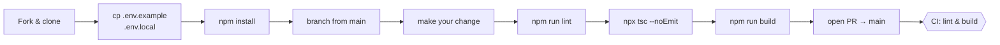

# Contributing to CareCompanion

Thanks for your interest in contributing. This document covers how to get set up, how work is organised, and the conventions the codebase follows.

---

## Table of contents

- [Code of conduct](#code-of-conduct)
- [Getting started](#getting-started)
- [Project structure](#project-structure)
- [Development workflow](#development-workflow)
- [Submitting changes](#submitting-changes)
- [Commit conventions](#commit-conventions)
- [Coding conventions](#coding-conventions)
- [Privacy constraints](#privacy-constraints)

---

## Code of conduct

Please read [CODE_OF_CONDUCT.md](CODE_OF_CONDUCT.md) before participating. All contributors are expected to follow it.

---

## Getting started

### Prerequisites

- Node.js 24+
- npm (comes with Node)
- A [Groq](https://console.groq.com/) API key for AI features

### Setup

```bash
git clone https://github.com/<your-fork>/CareCompanion.git
cd CareCompanion
npm install
```

Copy the template and fill it in:

```bash
cp .env.example .env.local
```

The [README Quick Start](README.md#-quick-start) has the full annotated variable list (NextAuth, Google OAuth, Groq, Supabase). For local development the fastest path is just two values:

```env
GROQ_API_KEY=your_groq_api_key_here
NEXT_PUBLIC_DEV_SKIP_AUTH=true   # bypasses Google login locally; ignored in production builds
```

Start the dev server:

```bash
npm run dev
```

Open [http://localhost:3000](http://localhost:3000).

> AI features (report upload, health chat, trigger analysis, visit prep, interaction checks) require a valid Groq key **and an authenticated session** — all AI routes return 401 without one, so keep `NEXT_PUBLIC_DEV_SKIP_AUTH=true` while developing locally. The rest of the app works without a Groq key.

---

## Project structure

```
app/                  Next.js App Router pages and API routes
  api/                Server-side route handlers (AI, report parsing, auth-scoped DB)
  medications/        Schedules, dose logging, adherence calendar & streak
  records/            Report upload, AI summary, extraction & import
  symptoms/           Severity log, timeline view, AI trigger analysis
  appointments/       Visit prep, post-visit notes, action-item checklist
  vitals/             At-home vitals + lab panels, trends, CSV export
  notes/              Dietary & other care notes with tags
  journal/            Daily caregiver journal
  emergency/          Emergency info card (blood type, allergies, contacts)
  chat/               Health Assistant
components/           Shared React components
contexts/             React context providers (profiles, notifications)
lib/                  localStorage helpers, AI route guard (api-guard.ts),
                      accessible dialog hook (useDialog.ts), backup, time utils
public/               Static assets, PWA manifest, service worker
```

All user health data lives in `localStorage` — there is no backend database for medical records. Supabase stores auth sessions only.

> 🧭 For a deeper map — the data layer, request lifecycles, module breakdown, and trust boundaries — see **[ARCHITECTURE.md](ARCHITECTURE.md)**.

Two conventions worth knowing before touching AI routes:
- **Every new AI route must call `guardAiRoute()`** from `lib/api-guard.ts` at the top of its handler (auth + rate limiting).
- **Batch operations must aggregate user feedback** — one summary toast or notice for N results, never one toast per item.

---

## Development workflow



1. **Fork** the repo and create a branch from `main`.
2. **Make your changes.** Keep each branch focused on one thing.
3. **Run the linter** before pushing: `npm run lint`
4. **Typecheck**: `npx tsc --noEmit` — must pass with zero errors.
5. **Build check**: `npm run build` — fix any TypeScript or build errors before opening a PR.
6. Open a pull request against `main`.

There are no automated tests at this time. Manual testing of the affected feature is expected before submitting.

---

## Submitting changes

- Keep PRs small and focused. One feature or fix per PR is strongly preferred.
- Fill in the PR description: what changed, why, and how to test it.
- Reference any related issue in the description (`Fixes #123`).
- Screenshots or screen recordings are appreciated for UI changes.

---

## Commit conventions

This project uses [Conventional Commits](https://www.conventionalcommits.org/):

```
<type>: <short description>
```

Common types:

| Type       | When to use                                      |
|------------|--------------------------------------------------|
| `feat`     | New user-facing feature                          |
| `fix`      | Bug fix                                          |
| `refactor` | Code change that neither adds a feature nor fixes a bug |
| `style`    | Formatting, whitespace — no logic change         |
| `docs`     | Documentation only                               |
| `chore`    | Tooling, deps, config                            |

Examples:

```
feat: add weekly frequency option to medication form
fix: prevent ICS export midnight race condition
docs: add setup instructions to README
```

---

## Coding conventions

- **TypeScript** throughout — avoid `any`.
- **Tailwind CSS** for styling. Avoid inline styles except for dynamic values (colours, widths) that can't be expressed as static classes.
- **Lucide React** for icons — pick from the existing library before adding new dependencies.
- **No comments that describe what the code does.** Only comment when the *why* is non-obvious.
- Keep components small and single-purpose. If a component is getting long, split the logic into a custom hook in `lib/` or break out a sub-component.
- `localStorage` access belongs in `lib/` helpers, not scattered across components.

---

## Privacy constraints

CareCompanion is privacy-first by design. Please keep these invariants intact:

- **No health data leaves the browser** except the minimum required for AI features (report text is processed in-flight and never stored server-side).
- **Patient names are never sent to any external service**, including Groq.
- No analytics, tracking pixels, or third-party scripts.
- Do not introduce a server-side database or any persistent backend storage for user health data.

Any contribution that weakens these guarantees will not be accepted regardless of other merits.

---

## Questions

Open a [GitHub issue](../../issues) for bugs, feature requests, or anything else. Discussions are welcome.
